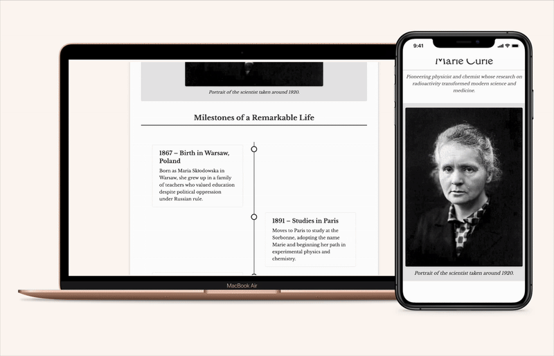

# 🧪 Marie Curie – Tribute Page

A static, fully **responsive** tribute page built with **semantic HTML5 and CSS3**, highlighting the major milestones in **Marie Curie’s life** and achievements.  
Designed for accessibility, clarity, and visual balance.

---

## Live Demo
🔗 [View Project](https://saleh-coder.github.io/marie-curie)  

**Preview:**  


---

## Built With


---

## Key Features
- **Semantic HTML5** structure with accessible markup and proper heading hierarchy.  
- **Responsive CSS3** design using Flexbox and media queries.  
- **Optimized Assets:** lightweight images and locally hosted fonts.  
- **Accessibility (A11y):** keyboard navigation and high-contrast colors.  
- **Clean Visual Hierarchy:** timeline layout emphasizing key life events.  

---

## How to Run Locally
```bash
git clone https://github.com/saleh-coder/marie-curie.git
cd marie-curie
open index.html
````

---

## Learning Notes

This project helped me:

* Understand the importance of **semantic structure** for accessibility and SEO.
* Practice **CSS responsiveness** without frameworks, focusing on media queries.
* Learn how to **organize project assets** (fonts, images, favicon) in a clean directory structure.
* Apply **accessible design** principles: keyboard focus, readable contrast, and descriptive `alt` text.
* Improve **README writing and documentation** for portfolio presentation.

---

## License

This project is open source under the [MIT License](LICENSE).

---

## Credits

Developed by **Amal Saleh**
Inspired by the brilliance and legacy of **Marie Curie**.

